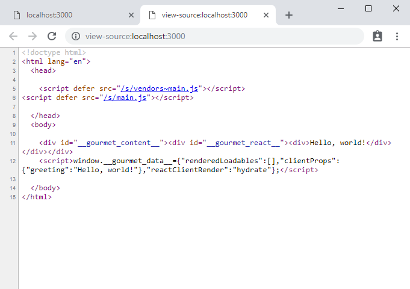
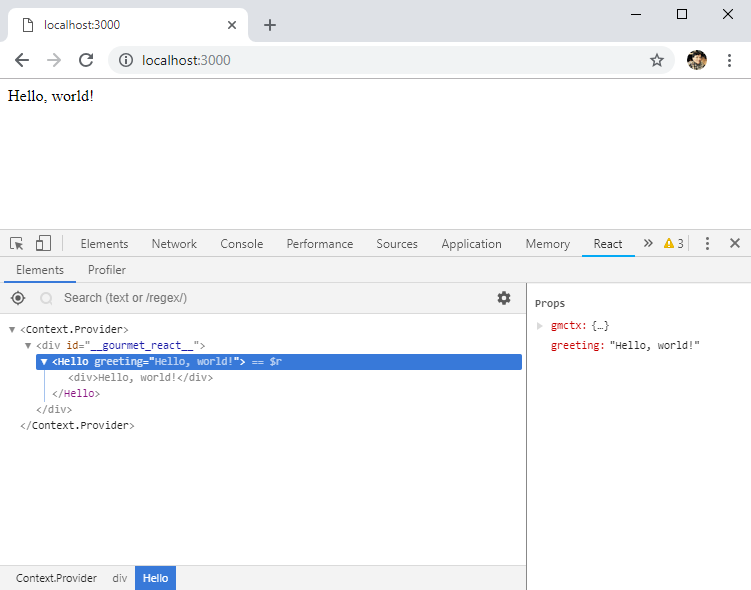

## Creating a simple Express server

First, let's write a simple Express server without Gourmet SSR.

**package.json**
```json
{
  "private": true,
  "scripts": {
    "start": "node lib/server.js"
  }
}
```

**lib/server.js**
```js
const express = require("express");

const app = express();

app.get("/", (req, res) => {
  res.send("Hello, world!");
});

app.listen(3000, () => {
  console.log("Server is listening on port 3000...");
});
```

Now install `express` and run the server.

```text
$ npm install express --save
$ npm start
Server is listening on port 3000
```

Open your browser at http://localhost:3000 and you will see the "Hello, world!" message.

Great, you are ready to explore Gourmet SSR now. Stop the server by pressing `Ctrl-C` and continue.

## Installing Gourmet SSR

Now, we will add the Server-Side Rendering (SSR) feature using Gourmet SSR to our Express server.

Install additional packages we need as below:

```text
$ npm install @gourmet/gourmet-cli @gourmet/preset-react react react-dom --save-dev
```

`@gourmet/gourmet-cli` provides a shell command `gourmet` which is a base command line interface that can be extended by installing additional plugins.

`@gourmet/preset-react` is a preset of sub-packages that contains all the tools and runtime helpers to build a Gourmet SSR project using React.

`react` and `react-dom` are standard React libraries. `@gourmet/preset-react` requires React libraries installed side by side as `peerDependencies`.

These packages are needed to build bundles, and once a Gourmet SSR project gets built, runtime helpers are embedded inside the bundles. That's why we can specify them as `devDependencies`. We don't need them ready under `node_modules` when the server is running. A simple rule to remember is:

1. Packages that your server code needs go to `dependencies`.
2. Packages that your SSR code needs go to `devDependencies`.

## Creating a page root component

Create a React component responsible for rendering the user interface.

**src/hello.js**
```jsx
import React from "react";

export default function Hello({greeting}) {
  return <div>{greeting}</div>;
}
```

By convention, we put all user interface code for SSR under `src` directory. They are "source" files to be compiled and bundled by Gourmet SSR whereas files under `lib` directory are executed directly by Node without any preprocessing.

We found this convention very useful, but you can use whatever directory structure you like.

## Creating a project configuration file

We also need to add a `gourmet_config.js` file which is a build configuration file for a Gourmet SSR project at the project root directory.

**gourmet_config.js**
```js
module.exports = {
  pages: {
    main: "./src/hello.js"
  }
};
```

Here, we specify the above React component as a root component of `main` page.

> Did you notice that we didn't specify manually what plugins to use in `gourmet_config.js`? Gourmet CLI will automatically scan dependencies specified in `package.json` and load available plugins/presets.
>
> As you can see, installing `@gourmet/preset-react` as a dependency is all you need to do to enable React support in your Gourmet SSR project. Of course, you can control this behavior if you need to.

## Integrating your server with SSR

Modify your server code to use Gourmet SSR to render the user interface.

**lib/server.js**
```js
const express = require("express");
const gourmet = require("@gourmet/client-lib");

const app = express();

app.use(gourmet.middleware());

app.get("/", (req, res) => {
  res.serve("main", {greeting: "Hello, world!"});
});

app.listen(3000, () => {
  console.log("Server is listening on port 3000");
});
```

Don't forget to install the Gourmet SSR Client Library that loads and executes your Gourmet SSR bundles. This one needs to go inside `dependencies` because your server depends on it.

```text
$ npm install @gourmet/client-lib --save
```

The middleware created by `gourmet.middleware()` adds `serve()` method to `res` object.

`res.serve(pageName, clientProps)` renders the content of page specified by `pageName`, with the props in `clientProps`, and then sends the result to the browser. `clientProps` must be a JSON serializable object because it is transferred to the client for rehydration.

By default, Gourmet SSR uses `ReactDOMServer.renderToNodeStream()` and `res.serve()` starts to send out the content of stream immediately to achieve the best [Time to First Byte](https://en.wikipedia.org/wiki/Time_to_first_byte) performance.

## Build and run

Before to run your server, you have to build the SSR bundles first. Gourmet SSR uses Webpack and Babel under the hood to compile your SSR code.

Add the `build` script to `package.json`.

**package.json**
```json
{
  ...
  "scripts": {
    "build": "gourmet build",
    "start": "node lib/server.js"
  }
  ...
}
```

Run the build command and start the server again.

```text
$ npm run build
server>
server> >>> Building 'local' stage for 'server' target...
server>
server> Hash: 67lUupnSCkvx5QS2PfiMN5B5M2d
server> Version: webpack 4.28.3
...
client>
client> >>> Building 'local' stage for 'client' target...
client>
client> Hash: 2X8CXpO82qOEnWcj6UiIi6eg5gv
client> Version: webpack 4.28.3
...
$ npm start
Server is listening on port 3000
```

Open your browser at http://localhost:3000. You will see "Hello, world!" message again, but this time it is rendered using a React component on the server-side, and rehydrated on the client-side.

## Anatomy of SSR

Let's inspect the result deeper to see how SSR worked. We use Chrome for this example but other browsers have similar features too.

On Chrome, right click on the screen of "Hello, world!" and select "View page source" from the popup menu. You will be able to see the original HTML page content that server sent out:



The content you rendered through `Hello` component is embedded inside `<div id="__gourmet_react__">` as children. Also, the `clientProps` you gave to `res.serve()` ended up here as a JSON object inside `<script>` block.

Another important feature of Gourmet SSR is statically rendered asset tags such as `<script>` in `<head>` section as shown here.

Using Gourmet SSR, all assets that are required for rendering a page are automatically linked statically. No client-side dynamic asset loading is involved. This is very important to prevent the rendering of incomplete state such as [Flash of Unstyled Content](https://en.wikipedia.org/wiki/Flash_of_unstyled_content).


 This also allows the browser to start downloading assets as early as possible while parsing the HTML. Combined with HTTP/2 push, this can maximize the page loading performance.

> Because `<script>` tags in `<head>` are rendered with `defer` attribute, they don't block browser from parsing HTML. `defer` is supported by most browsers including IE 10/11.

Next, let's inspect the client-side rehydration. To do this, you need to install [React Developer Tools](https://chrome.google.com/webstore/detail/react-developer-tools/fmkadmapgofadopljbjfkapdkoienihi?hl=en) Chrome Extension if you haven't done so already.

After the installtion is completed, press `<F12>` key to access Chrome Developer Tools and click the React tab.



If you can see a tree of React components as shown above, this means that the client-side rehydration was succesful and React took over the control of DOM management on the browser.

## What's inside the bundles?

Gourmet SSR builds your user interface code and generates two sets of bundles - one for the server and the other for the browser.

Because the server bundles are targeting Node 8 and the client bundles targeting browsers minimum of IE 11, the generated contents are differnt. Let's take a look at the client bundle first.

**.gourmet/local/client/main.js**
```js
// ... Webpack runtime ...
function Hello(_ref) {
  var greeting = _ref.greeting;
  return react__WEBPACK_IMPORTED_MODULE_0___default.a.createElement("div", {
    __source: {
      fileName: _jsxFileName,
      lineNumber: 4
    },
    __self: this
  }, greeting);
}
// ...
```

Compare it with the server bundle.

**.gourmet/local/server/main.js**
```js
// ... Webpack runtime and all vendor modules ...
function Hello({
  greeting
}) {
  return react__WEBPACK_IMPORTED_MODULE_0___default.a.createElement("div", {
    __source: {
      fileName: _jsxFileName,
      lineNumber: 4
    },
    __self: this
  }, greeting);
}
// ...
```

Because Node 8 supports destructuring natively, the server bundle uses the original source code's destructuring syntax `Hello({greeting})` intact.

The difference is small here but once you use more complicated ES6 features such as classes and iterators, the difference becomes more significant.

## That's it!

Congraturations! You finished the Getting Started guide and ready to learn more details about Gourmet SSR.
