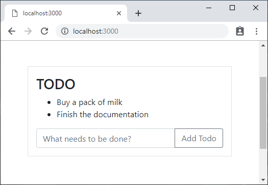

## Introduction

Apollo support in Gourmet SSR is provided as a single [group](../tutorial-1#preset-vs-group) package that you can add to your Gourmet SSR project. Installing the package will automatically enable the Apollo runtime, and the rest of your code will look the same as a typical Apollo project.

## Example app

The example project in this document is a simple todo app. You can get and run the example as below.

```text
git clone https://github.com/gourmetjs/gourmet-ssr
cd gourmet-ssr/examples/apollo
npm install
npm run dev
```

Open your browser and go to `http://localhost:3000`.

You will see a screen like this.



There are two todo items pre-populated from the server using GraphQL query. Whenever you click the "Add Todo" button, a new item will be added through a GraphQL mutation.

## Server source code

### lib/server.js

```js
"use strict";

const express = require("express");
const serverArgs = require("@gourmet/server-args");
const gourmet = require("@gourmet/client-lib");
const {ApolloServer} = require("apollo-server-express");
const schema = require("./schema");
const TodoData = require("./TodoData");
const resolvers = require("./resolvers");

const args = serverArgs({workDir: __dirname + "/.."});
const app = express();

const apollo = new ApolloServer({
  typeDefs: schema,
  dataSources() {
    return {todoData: new TodoData()};
  },
  resolvers
});

apollo.applyMiddleware({app});

app.use(gourmet.middleware(args));

app.get("/", (req, res) => {
  res.serve("main");
});

app.use(gourmet.errorMiddleware());

app.listen(args.port, () => {
  console.log(`Server is listening on port ${args.port}...`);
  console.log(`GraphQL path is ${apollo.graphqlPath}`);
});
```

### lib/schema.js

```js
"use strict";

const {gql} = require("apollo-server-express");

module.exports = gql`
type Query {
  todos: [String]!
}

type Mutation {
  addTodo(text: String!): String!
}
`;
```

### lib/resolvers.js

```js
"use strict";

module.exports = {
  Query: {
    todos(_, __, {dataSources}) {
      return dataSources.todoData.getAll();
    }
  },

  Mutation: {
    addTodo(_, {text}, {dataSources}) {
      return dataSources.todoData.addTodo(text);
    }
  }
};
```

### lib/TodoData.js

```js
"use strict";

const {DataSource} = require("apollo-datasource");

const _todos = [
  "Buy a pack of milk",
  "Finish the documentation"
];

module.exports = class TodoData extends DataSource {
  getAll() {
    return _todos.slice();  // make a shallow copy
  }

  addTodo(text) {
    _todos.push(text);
    return text;
  }
};
```

## User interface source code

### src/TodoApp.js

```js
import React, {Component} from "react";
import TodoMain from "./TodoMain";

export default class TodoApp extends Component {
  render() {
    return (
      <div className="container" style={{width: "400px", padding: "10em 0"}}>
        <TodoMain/>
      </div>
    );
  }
}
```

### src/TodoMain.js

```js
import React, {Component} from "react";
import {Query, Mutation} from "react-apollo";
import gql from "graphql-tag";

const GET_TODOS = gql`
query GetTodos {
  todos
}
`;

const ADD_TODO = gql`
mutation AddTodo($text: String!) {
  addTodo(text: $text)
}
`;

export default class TodoMain extends Component {
  state = {
    text: ""
  };

  render() {
    return (
      <div className="border p-3">
        <h3>TODO</h3>
        <Query query={GET_TODOS}>
          {({loading, error, data}) => {
            if (loading)
              return <div>Loading...</div>;
            if (error)
              return <div>Error!</div>;
            return (
              <ul id="todos">
                {data.todos.map((text, idx) => (
                  <li key={idx}>{text}</li>
                ))}
              </ul>
            );
          }}
        </Query>

        <Mutation
          mutation={ADD_TODO}
          update={(cache, {data: {addTodo}}) => {
            const {todos} = cache.readQuery({query: GET_TODOS});
            cache.writeQuery({
              query: GET_TODOS,
              data: {todos: todos.concat(addTodo)}
            });
          }}
        >
          {addTodo => (
            <form onSubmit={e => this.handleSubmit(e, addTodo)}>
              <div className="input-group">
                <input
                  id="add_todo"
                  className="form-control"
                  placeholder="What needs to be done?"
                  onChange={e => this.handleChange(e)}
                  autoFocus={true}
                  value={this.state.text}
                />
                <div className="input-group-append">
                  <button
                    id="add_button"
                    className="btn btn-outline-secondary"
                    type="submit"
                  >
                    Add Todo
                  </button>
                </div>
              </div>
            </form>
          )}
        </Mutation>
      </div>
    );
  }

  handleChange(e) {
    this.setState({text: e.target.value});
  }

  handleSubmit(e, addTodo) {
    e.preventDefault();
    if (!this.state.text.length)
      return;
    addTodo({variables: {text: this.state.text}});
    this.setState({text: ""});
  }
}
```

## Configuration source code

### gourmet_config.js

```js
module.exports = {
  pages: {
    main: "./src/TodoApp.js"
  },

  config: {
    html: {
      headTop: [
        '<link rel="stylesheet" href="https://stackpath.bootstrapcdn.com/bootstrap/4.3.1/css/bootstrap.min.css" integrity="sha384-ggOyR0iXCbMQv3Xipma34MD+dH/1fQ784/j6cY/iJTQUOhcWr7x9JvoRxT2MZw1T" crossorigin="anonymous">'
      ]
    }
  }
};
```

### package.json

```js
{
  "private": true,
  "scripts": {
    "build": "gourmet build",
    "start": "node lib/server.js",
    "dev": "nodemon --ignore src lib/server.js -- --watch"
  },
  "dependencies": {
    "@gourmet/client-lib": "^1.2.4",
    "@gourmet/server-args": "^1.2.4",
    "express": "^4.16.3",
    "apollo-server-express": "^2.4.8",
    "apollo-datasource": "^0.3.1",
    "graphql": "^14.1.1"
  },
  "devDependencies": {
    "@gourmet/gourmet-cli": "^1.1.4",
    "@gourmet/preset-react": "^1.2.10",
    "@gourmet/group-react-apollo": "^1.0.4",
    "react": "^16.8.4",
    "react-dom": "^16.8.4",
    "core-js": "2",
    "nodemon": "^1.18.10"
  }
}
```

## How it works

### Server

We are using the `apollo-server-express` package, instead of more commonly used `apollo-server` package, because we want to implement an Express server for both GraphQL serving and SSR rendering. `apollo-server-express` provides the GraphQL server functionality via a Connect/Express compatible middleware.

We are implementing very simple GraphQL schema that consists of one query and one mutation in `lib/schema.js`. Also, a todo item is defined as a string for simplicity.

`lib/TodoData.js` implements a simple Apollo data source. It uses a global variable `_todo` to save todo items. The data will be reset if the server restarts.

While your server is running, you can open `http://localhost:3000/graphql` in your browser to launch [GraphQL Playground](https://www.apollographql.com/docs/apollo-server/features/graphql-playground.html) and explore your GraphQL schema.

### User interface (SSR)

`TodoApp` is the page component for your app. It doesn't do anything special other than rendering the `TodoMain` component.

`TodoMain` uses `Query` and `Mutation` components from `react-apollo` to run GraphQL operations. In our app, `GetTodos` query is executed on the server side when the initial content is being rendered, and `AddTodo` mutation is executed on the client side when the user clicks `Add Todo` button.

### Packages

For our Express server, we are using the following packages. They are listed in `dependencies` section of `package.json` because the server needs them at runtime.

- `@gourmet/client-lib`: Gourmet SSR server renderer.
- `@gourmet/server-args`: Parsing the standard server command line options of Gourmet SSR project.
- `express`: Express server framework.
- `apollo-server-express`: Express and Connect integration of GraphQL Server.
- `apollo-datasource`: Base class of Apollo DataSource.
- `graphql`: GraphQL core library, should be installed side by side with `apollo-server-express` as a peer dependency.

For SSR code, we are using the following packages. They are listed in `devDependencies` section of `package.json` because they get built and embedded inside the SSR bundles.

- `@gourmet/preset-react`: A preset of React build tools and runtime helpers.
- `@gourmet/group-react-apollo`: A group of sub-packages that enables Apollo GraphQL support in your project. See below for more information.
- `react`: Standard React library.
- `react-dom`: Standard React library.
- `core-js`: An app-level dependency 

- `@gourmet/gourmet-cli`:
- `nodemon`:

 `@gourmet/group-react-apollo`. Adding it to your `devDependencies` will enable Apollo GraphQL in your Gourmet SSR project.

