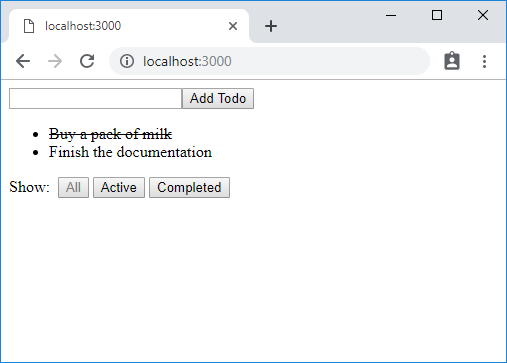

## Introduction

Usually, building a Redux app with the server-side rendering is a complicated task. That is not because Redux is particularly incompatible with SSR than others, but because enabling SSR itself is a complicated task.

However, as Gourmet SSR takes care of the most complications from the SSR-izing an app, using Redux in a Gourmet SSR project is surprisingly simple. It is just a matter of adding a snippet for bootstrapping. Let's see how.

## Example app

The example app in this document is based on the original [Redux Todos Example](https://github.com/reduxjs/redux/tree/master/examples/todos).

You can run the example as below:

```text
git clone https://github.com/gourmetjs/gourmet-ssr
cd gourmet-ssr/examples/redux
npm install
npm run dev
```

Open your browser and go to `http://localhost:3000`.

You will see a screen like below. There are two todo items pre-populated from the server.



## How it works

All the secret is in the `Root` component. This is the page component of the app.

```js
// src/containers/Root.js
import React from "react";
import {createStore} from "redux";
import {Provider} from "react-redux";
import App from "../components/App";
import rootReducer from "../reducers";

const Root = ({store}) => {
  return (
    <Provider store={store}>
      <App/>
    </Provider>
  );
};

const fetchInitialState = () => {
  return new Promise(resolve => {
    setTimeout(() => {
      resolve({
        todos: [{
          id: 1,
          text: "Buy a pack of milk",
          completed: true
        }, {
          id: 2,
          text: "Finish the documentation",
          completed: false
        }]
      });
    }, 10);
  });
};

Root.getStockProps = gmctx => {
  if (gmctx.isServer) {
    return fetchInitialState(gmctx).then(state => {
      gmctx.data.reduxState = state;
      return {
        store: createStore(rootReducer, state)
      };
    });
  } else {
    return {
      store: createStore(rootReducer, gmctx.data.reduxState)
    };
  }
};

export default Root;
```

`getStockProps()` is a static function of your page component. Here, it is used to create a Redux store.

Gourmet SSR will call the function to get the stock props before rendering the page component. The stock props you return from this function will be provided to the page component, combined with other root-level props, such as the props from `getInitialProps()` and/or `res.serve()`.

`getStockProps()` works very similar to `getInitialProps()`, which we showed you in the [tutorial](https://ssr.gourmetjs.org/docs/tutorial-5#getinitialprops). Compared to `getInitialProps()`, `getStockProps()` is:

- Always invoked before rendering, both on the server and the client.
- Allowed to return any type of values, not limited to JSON serializable objects.

In this example, we use the `fetchInitialState()` function to get the initial state for the Redux store on the server side. The data is hard-coded inside the function, simulating an asynchronous fetching operation using a promise. In your real application, this could be an API call or database fetching.

Note that we assign the initial state data to `gmctx.data.reduxState`. Everything you store under `gmctx.data` on the server side will be serialized as a JSON object and transferred to the client for re-hydration in Gourmet SSR. `gmctx` is a [context object](../tutorial-5#gourmet-context-gmctx) containing the information about a rendering session in Gourmet SSR.

On the client-side, the Redux store is re-hydrated with the state data from `gmctx.data.reduxState`. 

That's it! The other React components are the same as the original Redux example (other than some slight modifications for adjusting to our code style). With this simple snippet in your root component, Redux will be available to the rest of your React tree as usual. 

In case you are curious, this is the source code of the server.

```js
// lib/server.js
"use strict";

const express = require("express");
const serverArgs = require("@gourmet/server-args");
const gourmet = require("@gourmet/client-lib");

const args = serverArgs({workDir: __dirname + "/.."});
const app = express();

app.use(gourmet.middleware(args));

app.get("/", (req, res) => {
  res.serve("main");
});

app.use(gourmet.errorMiddleware());

app.listen(args.port, () => {
  console.log(`Server is listening on port ${args.port}...`);
});
```

As you can see, there is no special code for Redux. It is just a typical Express server for a Gourmet SSR project.

> In our example, the state data is not saved in any persistent storage, so it will be reset whenever the page is refreshed. We wanted to keep this example simple to show you only the important part of Redux integration.

## Adding Redux packages for existing projects

To use Redux in your existing Gourmet SSR project, you should install `redux` and `react-redux` packages. You can add them to `devDependencies` because you need Redux only in your SSR code.

```text
npm install redux react-redux --save-dev
```

## Advanced topics

### Supplying the initial state

In the example above, we explained a case that your initial state is fetched inside the SSR code via `getStockProps()` static function. This is a recommended pattern because the criteria of data to fetch usually depends on the user interface to render.

As an alternative, however, you can supply the initial state from your server via `res.serve()` function.

```js
// lib/server.js
"use strict";

const express = require("express");
const serverArgs = require("@gourmet/server-args");
const gourmet = require("@gourmet/client-lib");

const args = serverArgs({workDir: __dirname + "/.."});
const app = express();

function fetchInitialState() {
  return new Promise(resolve => {
    setTimeout(() => {
      resolve({
        todos: [{
          id: 1,
          text: "Buy a pack of milk",
          completed: true
        }, {
          id: 2,
          text: "Finish the documentation",
          completed: false
        }]
      });
    }, 10);
  });
};

app.use(gourmet.middleware(args));

app.get("/", (req, res, next) => {
  fetchInitialState().then(reduxState => {
    res.serve("main", {reduxState});
  }).catch(next);
});

app.use(gourmet.errorMiddleware());

app.listen(args.port, () => {
  console.log(`Server is listening on port ${args.port}...`);
});
```

With this approach, your `Root` component now becomes much simpler as the data fetching is not its responsibility and Gourmet SSR takes care of the dehydration and rehydration automatically.

```js
// src/containers/Root.js
import React from "react";
import {createStore} from "redux";
import {Provider} from "react-redux";
import App from "../components/App";
import rootReducer from "../reducers";

const Root = ({reduxState}) => {
  return (
    <Provider store={createStore(rootReducer, reduxState)}>
      <App/>
    </Provider>
  );
};

export default Root;
```

You can access the full source code of this example in the `examples/redux-init` folder.

### Using Redux with React I80 router

On the server side, `getStockProps()` is called with a freshly created `gmctx` every time a new HTTP request is served. You will always want this behavior to prevent any possible conflicts between requests.

On the client side, the change of route triggers the re-rendering of the whole React components tree, from the very root component. For this reason, a page component's `getStockProps()` will be called many times whenever the route changes, with a freshly created `gmctx`.

To preserve the state between routes switching on the client, you should use a global variable for your Redux store. See the source code below.

```js
// src/containers/Root.js
import React from "react";
import i80, {ActiveRoute} from "@gourmet/react-i80";
import {createStore} from "redux";
import {Provider} from "react-redux";
import App from "../components/App";
import Settings from "../components/Settings";
import rootReducer from "../reducers";

i80([
  ["/", App],
  ["/settings", Settings]
]);

const Root = ({store}) => {
  return (
    <Provider store={store}>
      <ActiveRoute/>
    </Provider>
  );
};

let clientReduxStore;

const fetchInitialState = () => {
  return new Promise(resolve => {
    setTimeout(() => {
      resolve({
        todos: [{
          id: 1,
          text: "Buy a pack of milk",
          completed: true
        }, {
          id: 2,
          text: "Finish the documentation",
          completed: false
        }]
      });
    }, 10);
  });
};

Root.getStockProps = gmctx => {
  if (gmctx.isServer) {
    return fetchInitialState(gmctx).then(state => {
      gmctx.data.reduxState = state;
      return {
        store: createStore(rootReducer, state)
      };
    });
  } else {
    if (!clientReduxStore)
      clientReduxStore = createStore(rootReducer, gmctx.data.reduxState);
    return {
      store: clientReduxStore
    };
  }
};

export default Root;
```

In this example, the Redux store is created only once, and stored in the global variable `clientReduxStore` on the client side.

To test the singleton Redux store, we split the user interface into two separate routes - `App` and `Settings`.

```js
// src/components/App.js
import React from "react";
import AddTodo from "../containers/AddTodo";
import VisibleTodoList from "../containers/VisibleTodoList";

const App = () => (
  <div>
    <AddTodo/>
    <VisibleTodoList/>
    <div>
      <br/>
      <a href="/settings">&#x00bb; Settings</a>
    </div>
  </div>
);

export default App;
```

```js
// src/components/Settings.js
import React from "react";
import Footer from "./Footer";

const Settings = () => (
  <div>
    <Footer/>
    <div>
      <br/>
      <a href="/">&#x00bb; Main</a>
    </div>
  </div>
);

export default Settings;
```

You can access the full source code of this example in the `examples/redux-i80` folder.

Run the example and verify that the state is preserved when you switch routes.
