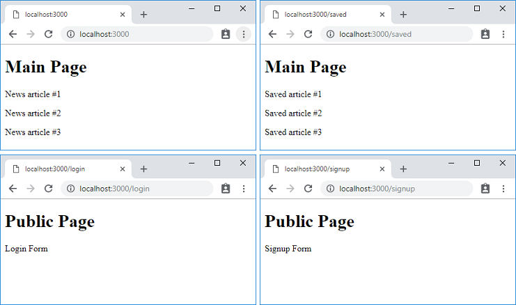

## What we will build

In this tutorial, we will build a news reader app. We'll start with a simple server and dummy user interface, and as we progress we will add more features to show you how to build a full-stack application using Gourmet SSR.

First, let's take a look at a screenshot of the final app that we are going to build.


This app works as follows:

- A user must log in to the app to access the main screen.
- The main screen has two panes that you can switch between using tabs.
- The "Latest News Headlines" pane displays a list of the latest news articles fetched from [`newsapi.org`](https://newsapi.org).
- The "Saved Articles" pane displays bookmarked news articles.
- Bookmarks are saved per user account.
- If there are more articles than displayed in the current pane, there will be a `Load more` button at the bottom of the list. If clicked, 10 more items are fetched and appended to the list.
- A user can log out by clicking the `Log out` button at the top right corner of the screen.

> This tutorial assumes that you have read the [Getting Started](/getting-started) guide, and are familiar with the key concepts described in it. If you haven't, please read it first and circle back.

## Creating project files

Create a new directory named `news-ssr`. Inside this directly is where you will create files as you follow this tutorial.

Alternatively, you can get these files from the GitHub repo if you prefer.

```text
git clone https://github.com/gourmetjs/news-ssr
cd news-ssr
git checkout step1
```

### lib/server.js

```js
"use strict";

const express = require("express");
const gourmet = require("@gourmet/client-lib");
const serverArgs = require("@gourmet/server-args");

const args = serverArgs({workDir: __dirname + "/.."});
const app = express();

app.use(gourmet.middleware(args));

app.get(["/login", "/signup"], (req, res) => {
  res.serve("public");
});

app.get(["/", "/saved"], (req, res) => {
  res.serve("main");
});

app.use(gourmet.errorMiddleware());

app.listen(args.port, () => {
  console.log(`Server is listening on port ${args.port}`);
});
```

### src/containers/PublicPage.js

```js
import React from "react";
import i80, {ActiveRoute} from "@gourmet/react-i80";
import LoginRoute from "./LoginRoute";
import SignupRoute from "./SignupRoute";

i80([
  ["/login", LoginRoute],
  ["/signup", SignupRoute]
]);

export default function PublicPage() {
  return (
    <div>
      <h1>Public Page</h1>
      <ActiveRoute/>
    </div>
  );
}
```

### src/containers/MainPage.js

```js
import React from "react";
import i80, {ActiveRoute} from "@gourmet/react-i80";
import NewsRoute from "./NewsRoute";
import SavedRoute from "./SavedRoute";

i80([
  ["/", NewsRoute],
  ["/saved", SavedRoute]
]);

export default function MainPage() {
  return (
    <div>
      <h1>Main Page</h1>
      <ActiveRoute/>
    </div>
  );
}
```

### src/containers/LoginRoute.js

```js
import React from "react";

export default function LoginRoute() {
  return (
    <div>
      <p>Login Form</p>
    </div>
  );
}
```

### src/containers/SignupRoute.js

```js
import React from "react";

export default function SignupRoute() {
  return (
    <div>
      <p>Signup Form</p>
    </div>
  );
}
```

### src/containers/NewsRoute.js

```js
import React from "react";

export default function NewsRoute() {
  return (
    <div>
      <p>News article #1</p>
      <p>News article #2</p>
      <p>News article #3</p>
    </div>
  );
}
```

### src/containers/SavedRoute.js

```js
import React from "react";

export default function SavedRoute() {
  return (
    <div>
      <p>Saved article #1</p>
      <p>Saved article #2</p>
      <p>Saved article #3</p>
    </div>
  );
}
```

### gourmet_config.js

```js
module.exports = {
  pages: {
    public: "./src/containers/PublicPage",
    main: "./src/containers/MainPage"
  }
};
```

### package.json

```json
{
  "private": true,
  "scripts": {
    "build": "gourmet build",
    "start": "node lib/server.js",
    "dev": "nodemon --ignore src lib/server.js -- --watch"
  },
  "dependencies": {
    "express": "^4.16.4",
    "@gourmet/server-args": "^1.2.1",
    "@gourmet/client-lib": "^1.2.0"
  },
  "devDependencies": {
    "@gourmet/gourmet-cli": "^1.1.0",
    "@gourmet/preset-react": "^1.2.3",
    "@gourmet/group-react-i80": "^1.2.0",
    "react": "^16.8.1",
    "react-dom": "^16.8.1",
    "nodemon": "^1.18.10"
  }
}
```

## Building and running

Now, install dependencies and run the app.

```text
npm install
npm run build
npm start
```

Open your browser and try the following URLs.

- http://localhost:3000/
- http://localhost:3000/saved
- http://localhost:3000/login
- http://localhost:3000/singup

You will see screens like these.



## Routing using React I80

React I80 is a tiny, isomorphic routing library specifically designed for Gourmet SSR. Using React I80, you can divide the user interface of your app into more manageable smaller units called routes, and associate them with URLs. Also, you can group multiple routes into pages.

### Pages and Routes

Switching between routes inside the same page happens on the client-side, and no round-trip to the server is made. On the other hand, each page is a completely separated HTML endpoint from the other. A transition between pages always happens in a clean, new browser session.

Using Gourmet SSR, you are not limited to a single HTML page for your whole app. In fact, splitting your app into multiple pages is an encouraged pattern for better user experience. At the least, you must separate the content for the authenticated state from the unauthenticated public content for security reasons. With this in mind, we structured our pages and routes as below.

```text
PublicPage --+-- LoginRoute
             |
             +-- SignupRoute

MainPage ----+-- NewsRoute
             |
             +-- SavedRoute
```

First, the server is responsible for directing requests to the corresponding pages based on URLs.

```js
// lib/server.js
app.get(["/login", "/signup"], (req, res) => {
  res.serve("public");
});

app.get(["/", "/saved"], (req, res) => {
  res.serve("main");
});
```

And then, inside each page, you define routes for the page using the top-level `i80()` function, exported by `@gourmet/react-i80`. For example, the public page defines its routes as below:

```js
// src/containers/PublicPage.js
import i80, {ActiveRoute} from "@gourmet/react-i80";
//...
i80([
  ["/login", LoginRoute],
  ["/signup", SignupRoute]
]);
```

You must call the `i80()` function just once at the global level to initialize React I80. `i80()` expects an array of arrays containing a pair of elements. Each element within the array consists of a URL path and a React route component.

Inside the page's rendering function, the `ActiveRoute` component is used to render a route component that matches the current URL.

```js
// src/containers/PublicPage.js
export default function PublicPage() {
  return (
    <div>
      <h1>Public Page</h1>
      <ActiveRoute/>
    </div>
  );
}
```

### About the package dependency

To use React I80 in your project, you must add the package `@gourmet/group-react-i80` as a dependency in addition to `@gourmet/preset-react`. `@gourmet/group-react-i80` is a group of sub-packages that enables a React I80 support in your project.

Inside your SSR code, you import `@gourmet/react-i80` to implement your routing logic as shown above. `@gourmet/react-i80` is the main package that exposes user APIs. It comes as a sub-package in `@gourmet/group-react-i80`, so you don't need to add it as a dependency in your `package.json`. Just import it inside your SSR code and Gourmet Builder will resolve it to the sub-package inside `@gourmet/group-react-i80`.

> #### Preset vs group
> In Gourmet SSR, a preset is a complete set of sub-packages that defines the target environment of your Gourmet SSR project. Presets are mutually exclusive, so your app must use only one preset in your app. (e.g. React vs Vue)
>
> On the other hand, a group is a set of related sub-packages to support additional functionality, on top of a preset. Groups can be used together based on your needs. Internally, groups are used as building blocks of presets.

## Automatic rebuilding and reloading

Whenever you change your source code, you must stop your server using `Ctrl-C`, rebuild using `npm run build`, and restart using `npm start`. This is a very error-prone and tedious task.

Try `node lib/server.js --watch` instead. Now, whenever you change your SSR related source code, it will be rebuilt, and the browser page will be reloaded to apply the change.

This automatic rebuild feature is enabled through two parts. First, you use `@gourmet/server-args` to parse the standard command line options such as `--watch` into the arguments object like `{watch: true}`.

```js
// lib/server.js
const serverArgs = require("@gourmet/server-args");
//...
const args = serverArgs({workDir: __dirname + "/.."});
```

`workDir` option to `serverArgs()` specifies the working directory of Gourmet SSR project where `gourmet_config.js` is located. Gourmet SSR needs to know the directory to locate the build output directory `.gourmet`.

Next, you hand over the parsed arguments object to the middleware.

```js
// lib/server.js
app.use(gourmet.middleware(args));
```

Through this, Gourmet SSR knows when `--watch` command line option is given, and enables the watch mode.

One missing part here is the rebuild of the server code. The `--watch` option monitors SSR related code only. If you change your server code, you still need to stop and restart manually. That is where `nodemon` can be helpful. In `package.json`, we have `dev` script defined as below:

```text
// package.json
// ...
"dev": "nodemon --ignore src lib/server.js -- --watch"
```

If you run the `dev` script, `modemon` will start your server by launching `lib/server.js` with `--watch` option, and it will restart your sever whenever it detects changes in `*.js` files. However, it excludes `src` directory from monitoring because the files inside it will be monitored and rebuilt separately by Gourmet SSR.

Now, keep the following command running in the background while you are working on the source code to get quick feedback.

```text
npm run dev
```

> #### What about hot module reloading?
> Currently, Gourmet SSR doesn't support the hot module reloading (HMR), because our experimental implementation with `react-hot-loader` didn't give us enough confidence that it would work stable for every scenario. Perhaps, we may want to give it another try when React itself becomes more [HMR friendly](https://twitter.com/dan_abramov/status/1055707267037749249).

## More on the server implementation helpers

### `serverArgs()`

`--watch` is not the only option that `@gourmet/server-args` supports. In our server code above, we use `args.port` to get the port number to listen to. It will be derived from `--port` command line option, `PORT` environment variable, or default value of `3000`, in the order of priority.

### `gourmet.errorMiddleware()`

`gourmet.errorMiddleware()` returns an error handling middleware (a Connect/Express compatible middleware with four arguments `(err, req, res, next)`). You should install it as the last error handler in your middleware chain. In addition to the customizable error page rendering, it will also take care of Gourmet SSR specific tasks such as embedding `--watch` support runtime in error pages, and sending out JSON error responses (i.e. `{error: {...}}`) to JSON requests.
