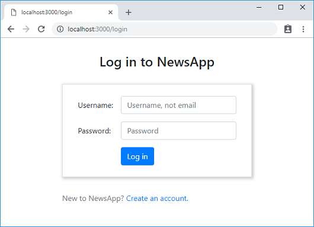
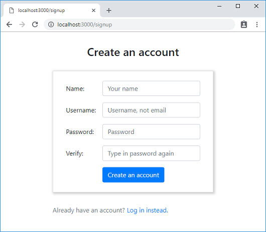

## What we will add in this step

Now that we have completed the basic structure of our app, we can add the real user interface of `LoginView` and `SignupView`.

The final result would look like the following.




You can get the final source files of this step from the GitHub repo as below:

```text
git clone https://github.com/gourmetjs/news-ssr
cd news-ssr
git checkout step2
```

## Editing / creating source files

### lib/server.js

```js
"use strict";

const express = require("express");
const gourmet = require("@gourmet/client-lib");
const serverArgs = require("@gourmet/server-args");
const bodyParser = require("body-parser");

const args = serverArgs({workDir: __dirname + "/.."});
const app = express();

app.use(bodyParser.json());
app.use(gourmet.middleware(args));

app.post("/api/signup", (req, res) => {
  console.log("/api/signup", req.body);
  res.json({});
});

app.post("/api/login", (req, res) => {
  console.log("/api/login", req.body);
  res.json({});
});

app.get(["/login", "/signup"], (req, res) => {
  res.serve("public");
});

app.get(["/", "/saved"], (req, res) => {
  res.serve("main");
});

app.use(gourmet.errorMiddleware());

app.listen(args.port, () => {
  console.log(`Server is listening on port ${args.port}`);
});
```

### src/containers/PublicPage.js _(new)_

```js
import React from "react";
import i80, {ActiveRoute} from "@gourmet/react-i80";
import LoginView from "./LoginView";
import SignupView from "./SignupView";

i80([
  ["/login", LoginView],
  ["/signup", SignupView]
]);

export default function PublicPage() {
  return (
    <div className="container">
      <ActiveRoute/>
    </div>
  );
}
```

### src/containers/LoginView.js _(new)_

```js
import React, {Component} from "react";
import i80 from "@gourmet/react-i80";
import httpApi from "../utils/httpApi";
import CenteredBox from "../components/CenteredBox";
import HorzForm from "../components/HorzForm";

export default class LoginView extends Component {
  static HEADER = (<h3>Log in to NewsApp</h3>);
  static FOOTER = (<p>New to NewsApp? <a href="/signup">Create an account.</a></p>);

  usernameRef = React.createRef();
  passwordRef = React.createRef();

  render() {
    return (
      <CenteredBox header={LoginView.HEADER} footer={LoginView.FOOTER}>
        <HorzForm onSubmit={() => this.onSubmit()}>
          <div className="form-group row">
            <label htmlFor="username" className="col-sm-3 col-form-label">Username:</label>
            <div className="col-sm-9">
              <input type="text" className="form-control" id="username" name="username"
                placeholder="Username, not email" ref={this.usernameRef} required/>
            </div>
          </div>
          <div className="form-group row">
            <label htmlFor="password" className="col-sm-3 col-form-label">Password:</label>
            <div className="col-sm-9">
              <input type="password" className="form-control" id="password" name="password"
                placeholder="Password" ref={this.passwordRef} required/>
            </div>
          </div>
          <div className="form-group row">
            <div className="offset-sm-3 col-sm-9">
              <button type="submit" className="btn btn-primary">
                Log in
              </button>
            </div>
          </div>
        </HorzForm>
      </CenteredBox>
    );
  }

  onSubmit() {
    const username = this.usernameRef.current.value.toLowerCase().trim();
    const password = this.passwordRef.current.value.trim();

    return httpApi("/api/login", {
      method: "POST",
      body: {username, password}
    }).then(() => {
      i80.goToUrl("/");
    });
  }
}
```

### src/containers/SignupView.js _(new)_

```jsx
import React, {Component} from "react";
import i80 from "@gourmet/react-i80";
import httpApi from "../utils/httpApi";
import CenteredBox from "../components/CenteredBox";
import HorzForm from "../components/HorzForm";

export default class SignupView extends Component {
  static HEADER = (<h3>Create an account</h3>);
  static FOOTER = (<p>Already have an account? <a href="/login">Log in instead.</a></p>);

  nameRef = React.createRef();
  usernameRef = React.createRef();
  passwordRef = React.createRef();
  verifyRef = React.createRef();

  render() {
    return (
      <CenteredBox header={SignupView.HEADER} footer={SignupView.FOOTER}>
        <HorzForm onSubmit={() => this.onSubmit()}>
          <div className="form-group row">
            <label htmlFor="name" className="col-sm-3 col-form-label">Name:</label>
            <div className="col-sm-9">
              <input type="text" className="form-control" id="name" name="name"
                placeholder="Your name" ref={this.nameRef} required
              />
            </div>
          </div>
          <div className="form-group row">
            <label htmlFor="username" className="col-sm-3 col-form-label">Username:</label>
            <div className="col-sm-9">
              <input type="text" className="form-control" id="username" name="username"
                placeholder="Username, not email" ref={this.usernameRef}
                required pattern="[A-Za-z0-9._-]{2,20}"
                title="Only letters, numbers, dots, dashes and underscores / min 2 characters"
              />
            </div>
          </div>
          <div className="form-group row">
            <label htmlFor="password" className="col-sm-3 col-form-label">Password:</label>
            <div className="col-sm-9">
              <input type="password" className="form-control" id="password" name="password"
                placeholder="Password" ref={this.passwordRef} required/>
            </div>
          </div>
          <div className="form-group row">
            <label htmlFor="verify" className="col-sm-3 col-form-label">Verify:</label>
            <div className="col-sm-9">
              <input type="password" className="form-control" id="verify" name="verify"
                placeholder="Type in password again" ref={this.verifyRef} required/>
            </div>
          </div>
          <div className="form-group row">
            <div className="offset-sm-3 col-sm-9">
              <button type="submit" className="btn btn-primary">
                Create an account
              </button>
            </div>
          </div>
        </HorzForm>
      </CenteredBox>
    );
  }

  onSubmit() {
    const name = this.nameRef.current.value.trim();
    const username = this.usernameRef.current.value.toLowerCase().trim();
    const password = this.passwordRef.current.value.trim();
    const verify = this.verifyRef.current.value.trim();

    if (password !== verify)
      throw Error("Two passwords don't match");

    return httpApi("/api/signup", {
      method: "POST",
      body: {name, username, password}
    }).then(() => {
      i80.goToUrl("/");
    });
  }
}
```

### src/components/CenteredBox.js _(new)_

```js
import React from "react";

export default function CenteredBox({width="25em", header, footer, children}) {
  return (
    <div style={{width, margin: "2em auto"}}>
      <div style={{textAlign: "center"}}>
        {header}
      </div>
      <div style={{
        margin: "2em 0",
        border: "1px solid #ddd",
        boxShadow: "2px 2px 8px 1px rgba(0, 0, 0, 0.2)"
      }}>
        {children}
      </div>
      <div className="text-muted">
        {footer}
      </div>
    </div>
  );
}
```

### src/components/HorzForm.js _(new)_

```js
import React, {Component} from "react";

export default class HorzForm extends Component {
  state = {
    isPending: false,
    lastError: null
  };

  componentDidMount() {
    this._isMounted = true;
  }

  componentWillUnmount() {
    this._isMounted = false;
  }

  render() {
    const {children} = this.props;
    const {isPending, lastError} = this.state;
    return (
      <>
        <form onSubmit={e => this.onSubmit(e)} style={{margin: "1.5em 2em 0.5em 2em"}}>
          <fieldset disabled={isPending}>
            {lastError && (
              <div className="form-group row">
                <div className="alert alert-danger" style={{width: "100%"}}>{lastError}</div>
              </div>
            )}
            {children}
          </fieldset>
        </form>
        {isPending && (
          <div className="progress" style={{height: "8px", opacity: "0.65"}}>
            <div className="progress-bar progress-bar-striped progress-bar-animated" style={{width: "100%"}}/>
          </div>
        )}
      </>
    );
  }

  onSubmit(e) {
    const {onSubmit} = this.props;

    e.preventDefault();

    if (this.state.isPending)
      return;

    this.setState({isPending: true});

    Promise.resolve().then(() => {
      return onSubmit();
    }).then(clear => {
      if (clear && this._isMounted) {
        this.setState({
          isPending: false,
          lastError: null
        });
      }
    }).catch(err => {
      if (this._isMounted) {
        this.setState({
          isPending: false,
          lastError: err.message || err.toString()
        });
      }
    });
  }
}
```

### src/utils/httpApi.js _(new)_

```js
export default function httpApi(url, options) {
  options = Object.assign({
    headers: {},
    credentials: "same-origin"
  }, options);
  options.headers.accept = "application/json";

  if (options.body) {
    options.body = JSON.stringify(options.body);
    options.headers["content-type"] = "application/json";
  }

  return fetch(url, options).then(res => {
    return res.json().then(data =>{
      if (res.status !== 200) {
        const obj = data.error || {};
        const err = new Error(obj.message || res.statusText);
        err.code = obj.code;
        err.statusCode = obj.statusCode || res.status;
        err.detail = obj.detail;
        throw err;
      }
      return data;
    });
  });
}
```

### gourmet_config.js

```js
module.exports = {
  pages: {
    public: "./src/containers/PublicPage",
    main: "./src/containers/MainPage"
  },

  config: {
    html: {
      headTop: [
        '<link href="//stackpath.bootstrapcdn.com/bootstrap/4.1.0/css/bootstrap.min.css" rel="stylesheet" integrity="sha384-9gVQ4dYFwwWSjIDZnLEWnxCjeSWFphJiwGPXr1jddIhOegiu1FwO5qRGvFXOdJZ4" crossorigin="anonymous">'
      ]
    }
  }
};
```

### package.json

```json
{
  "private": true,
  "scripts": {
    "build": "gourmet build",
    "start": "node lib/server.js",
    "dev": "nodemon --ignore src lib/server.js -- --watch"
  },
  "dependencies": {
    "express": "^4.16.4",
    "@gourmet/server-args": "^1.2.1",
    "@gourmet/client-lib": "^1.2.0",
    "body-parser": "^1.18.3"
  },
  "devDependencies": {
    "@gourmet/gourmet-cli": "^1.1.0",
    "@gourmet/preset-react": "^1.2.2",
    "@gourmet/group-react-i80": "^1.2.0",
    "react": "^16.8.1",
    "react-dom": "^16.8.1",
    "nodemon": "^1.18.10"
  }
}
```

## Implementing `LoginView` and `SingupView`

In `LoginView`, we used `CenteredBox` to wrap our content inside a centered, shadowed box. It also supports a header and a footer. Inside the `CenteredBox`, we used `HorzForm` to render a form that supports an API based submit button.

```js
// src/containers/LoginView.js
export default class LoginView extends Component {
  //...
  render() {
    return (
      <CenteredBox header={LoginView.HEADER} footer={LoginView.FOOTER}>
        <HorzForm onSubmit={() => this.onSubmit()}>
          //...
```

The actual form fields are given as children of `HorzForm`. We used Bootstrap's styling class names to control the layout. See Bootstrap [documentation](https://getbootstrap.com/docs/4.3/components/forms/) for details.

When a user clicks the `Log in` button, `onSubmit()` is executed. `HorzForm` expects the `onSubmit` handler to return a promise. While the promise is pending, `HorzForm` will display a progress bar with all fields disabled. If the promise is successfully fulfilled with a truthy value, `HorzForm` will re-enable the fields and accept further user interaction on the form. If the promise is rejected with an error, `HorzForm` will display the error message and re-enable the fields to allow the user to retry.

In our code, if a POST HTTP request to `/api/login` succeeds, we will redirect the browser to the URL `/`, using React I80's `i80.goToUrl()` function. During the transition, the fields will be kept disabled because the promise will be fulfilled with a falsy value `undefined`. As there is no route that matches with `/` in the current page, a new request to the server will be made to load the page containing the `/` route.

`SignupView` is a little longer than `LoginView` because of more fields, but the structure is exactly the same.

On the server-side, we added dummy APIs for testing.

```js
// lib/server.js
// ...
app.post("/api/signup", (req, res) => {
  console.log("/api/signup", req.body);
  res.json({});
});

app.post("/api/login", (req, res) => {
  console.log("/api/login", req.body);
  res.json({});
});
```

## Default behavior of `fetch()` with cookies

`httpApi()` is a small helper function to invoke server APIs from the SSR code, using the [standard](https://developer.mozilla.org/en-US/docs/Web/API/Fetch_API/Using_Fetch) `fetch()` method.

By default, `fetch()` will send and receive any cookies associated with the target domain. We depend on this behavior to implement authentication in this tutorial. However, one caveat of this default behavior is that, it is a relatively new [change](https://github.com/whatwg/fetch/pull/585) in the specification. Before the change, cookie-less operation was the default. To make the cookie behavior consistent in the old browsers too, `httpApi()` always sets `credentials: "same-origin"` option.

In addition to this, `httpApi()` also takes care of the JSON encoding/decoding of the payload, and the error response formatted by `gourmet.errorMiddleware()`.

## Maintaining `_isMounted` flag

In `HorzForm` component, we are maintaining a flag `_isMounted` to avoid calling `setState()` for the unmounted component. This is an antipattern according to the React [documentation](https://reactjs.org/blog/2015/12/16/ismounted-antipattern.html).

However, we are dealing with a different pattern here. It is used to handle a case that `HorzForm` component gets unmounted by user's `onSubmit` handler. Unlike the example in the React documentation, this is a legitimate use case that doesn't result in a memory leak.

## Styling using Bootstrap

### Using the compiled CSS from the public CDN

In this tutorial, we use Bootstrap for styling our app. The simplest way to use Bootstrap in Gourmet SSR project is to use the public CDN version of the compiled CSS. To do this, we added `config.html.headTop` section to `gourmet_config.js`.

```js
// gourmet_config.js
module.exports = {
  // ...
  config: {
    html: {
      headTop: [
        '<link href="//stackpath.bootstrapcdn.com/bootstrap/4.1.0/css/bootstrap.min.css" rel="stylesheet" integrity="sha384-9gVQ4dYFwwWSjIDZnLEWnxCjeSWFphJiwGPXr1jddIhOegiu1FwO5qRGvFXOdJZ4" crossorigin="anonymous">'
      ]
    }
  }
};
```

### Alternative way: import CSS

Alternatively, you can install the `bootstrap` package and import the compiled CSS file at the pages you want to use as below.

```text
npm install bootstrap --save-dev
```

```js
// in PublicPage.js & MainPage.js
import "bootstrap/dist/css/bootstrap.min.css";
```

If you import a CSS file in Gourmet SSR, it is statically linked to the HTML page as an external asset via a `<link rel="stylesheet">` tag.
All asset references inside it (`url`, `@import`, ...etc) will be processed as well.

This way, you can eliminate the dependency to the external CDN, and serve Bootstrap from your own server together with other local assets which can be more efficient based on your deployment setup. However, for our tutorial, the public CDN works perfectly well.

### Using the global stylesheet with minimal per-component customization

You would notice that we used both Bootstrap's global class names and per-component inline styles as below.

```js
// src/containers/PublicPage.js
<div className="container">

// src/components/CenteredBox.js
<div style={{width, margin: "2em auto"}}>
```

This is a pattern that we found very effective: use a CSS framework such as Bootstrap as a base stylesheet globally, and do the additional, per-component customization using the inline style, or other CSS-in-JS libraries such as Emotion, which we will show you in the later steps.

Key point here is to utilize the global stylesheet whenever possible, and keep the per-component styling as minimal as possible. Because browsers are designed to work best with global CSS stylesheets, minimizing JavaScript based ad-hoc styling will save you from many unexpected issues down the line.

## Using ES proposal syntax

You may not be familiar with the [class fields](http://2ality.com/2017/07/class-fields.html) syntax of JavaScript in the following example.

```js
// src/containers/LoginView.js
export default class LoginView extends Component {
  static HEADER = (<h3>Log in to NewsApp</h3>);
  //...
  usernameRef = React.createRef();
  //...
}
```

This is not in the final standard yet, but it is currently at stage 3, which is the last stage of the standardization process, so it is pretty safe to use. Gourmet SSR supports the syntax by default. See [this](#LATER) for more details about Gourmet SSR's support of ES proposals.

## Container components vs presentational components

`CenteredBox` and `HorzForm` are presentational components that are located inside `src/components`, while pages and views were put inside `src/containers`. In this tutorial, we follow a simple but powerful pattern that divides components into two categories: container components and presentational components. Our criteria are as follows.

Container components:
- are concerned with how things work.
- are aware of the application specific configuration.
- provide "glue" work such as invoking server APIs.
- are usually not reusable in other apps.

Presentational components:
- are concerned with how things look.
- are building blocks that are reusable in other apps.
- usually get the data to render from the parent as props.
- delegate "glue" logic to the parent through event handler props.

See [this article](https://medium.com/@dan_abramov/smart-and-dumb-components-7ca2f9a7c7d0) for more details. By following this pattern, and decoupling your presentational components from application specifics, your code will get cleaner, and the reusability will increase.

## Running and testing

In this step, we added the following new package as a dependency:

- `body-parser`: Parses the JSON payload from the HTTP request body.

Build and run your app as below.

```text
npm install
npm run dev
```

Open your browser, go to `http://localhost:3000/login`, enter arbitrary username and password (e.g. `foo` / `1234`), and click the `Log in` button.

You should see the browser get redirected to `/`, and the following message in the terminal where you are running the server.

```text
/api/login { username: 'foo', password: '1234' }
```
