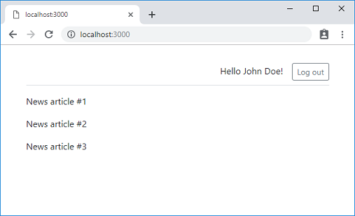

## What we will add in this step

We will add the actual authentication functionality to our server. On the client side, there will not be much modification other than adding the common header containing `Log out` button to `MainPage` as shown below.




You can get the final source files of this step from the GitHub repo as below:

```text
git clone https://github.com/gourmetjs/news-ssr
cd news-ssr
git checkout step3
```

## Database access using Knex

We will use SQL database as a back-end storage for user authentication - maintaining usernames & password hashes, logged-in sessions, ...etc.

Instead of using the raw SQL or fully-abstract ORM, we chose [Knex](https://knexjs.org/) as a [thin-layer](https://blog.logrocket.com/why-you-should-avoid-orms-with-examples-in-node-js-e0baab73fa5) to support multiple dialects of SQL engines. For this tutorial, we will use SQLite for local development, and PostreSQL for production deployment.

### package.json

```json
{
  "private": true,
  "scripts": {
    "build": "gourmet build",
    "start": "node lib/server.js",
    "dev": "nodemon --ignore src lib/server.js -- --watch",
    "migrate": "knex migrate:latest",
    "migrate:rollback": "knex migrate:rollback"
  },
  "dependencies": {
    "express": "^4.16.4",
    "@gourmet/server-args": "^1.2.1",
    "@gourmet/client-lib": "^1.2.0",
    "body-parser": "^1.18.3",
    "@gourmet/error": "^0.3.1",
    "knex": "^0.16.3",
    "pg": "^7.8.0",
    "sqlite3": "^4.0.6",
    "express-session": "^1.15.6",
    "connect-session-knex": "^1.4.0",
    "bcrypt": "^3.0.4"
  },
  "devDependencies": {
    "@gourmet/gourmet-cli": "^1.1.0",
    "@gourmet/preset-react": "^1.2.2",
    "@gourmet/group-react-i80": "^1.2.0",
    "react": "^16.8.1",
    "react-dom": "^16.8.1",
    "nodemon": "^1.18.10"
  }
}

```

We added two scripts `migrate` and `migrate:rollback` to use Knex's migration commands as described below.

We also added the following packages as dependencies:

- `@gourmet/error`: A helper for constructing Error objects.
- `knex`: Knex core
- `sqlite3`: SQLite client
- `pg`: PostgreSQL client
- `express-session`: Session middleware for Express
- `connect-session-knex`: Knex backed session store
- `bcrypt`: Node.js binding of bcrypt, a popular password hashing library written in C.

### migrations/0000_create_users.js

Knex provides a structured way to maintain the history of your SQL schema modifications (e.g. `CREATE TABLE` or `ALTER TABLE`) through a feature called migrations. Migrations help you implement your schema modifications incrementally in backward compatible way, which is important in production environment - you can't simply delete the whole database and restart with a different schema.

You put your migration files under `migrations` directory of your project's root. Each migration file is a JavaScript file exporting `up()` and `down()` functions. This is our migration file to create `users` table.

```js

exports.up = async function(knex) {
  await knex.schema.createTable("users", table => {
    table.increments("id");
    table.string("username").notNullable().unique();
    table.string("password");
    table.string("name");
  });
};

exports.down = async function(knex) {
  await knex.schema.dropTable("users");
};
```

See Knex [documentation](https://knexjs.org/#Schema) for details about the schema API.

When you run `npm run migrate` command, `up()` function of each migration file will be invoked, in the lexicographical order of filenames - that's why the filename starts with digits. Knex internally maintains a separate database table (`knex_migrations`) to keep track of the applied migrations and skips already applied ones. So, `npm run migrate` command is safe to run many times.

`down()` is a reverse function of `up()` to rollback the schema modification, invoked by `npm run migrate:rolleback` command.

### knexfile.js

To execute migration commands, Knex CLI needs to know how to connect to the SQL database server. `knexfile.js` is a configuration file for that.

```js
"use strict";

const args = require("@gourmet/server-args")();

let knexConfig;

if (args.stage === "local") {
  knexConfig = {
    client: "sqlite3",
    connection: {
      filename: `${__dirname}/.news-ssr.sqlite3`
    },
    useNullAsDefault: true
  };
} else {
  if (!process.env.PG_CONNECTION_STRING)
    throw Error("PostgreSQL connection string must be given via an environment variable PG_CONNECTION_STRING");

  knexConfig = {
    client: "pg",
    connection: process.env.PG_CONNECTION_STRING
  };
}

module.exports = knexConfig;
```

Our `knexfile.js` exports a different configuration object based on the stage. If the stage is `local` which is the default value in Gourmet SSR, SQLite database file `.news-ssr.sqlite3` is used. Otherwise, PostgreSQL is used with a connection string specified in `PG_CONNECTION_STRING` environment variable.

You can specify the stage using `STAGE` environment variable or `--stage` command line option. `@gourmet/server-args` will take care of these and return an object like `{stage: "local"}` for you.

## Server code

### lib/server.js

```js
"use strict";

const express = require("express");
const gourmet = require("@gourmet/client-lib");
const serverArgs = require("@gourmet/server-args");
const bodyParser = require("body-parser");
const session = require("express-session");
const KnexSessionStore = require("connect-session-knex")(session);
const knex = require("./knex");
const account = require("./account");

const SESSION_COOKIE_NAME = "session_id";

const args = serverArgs({workDir: __dirname + "/.."});
const app = express();

app.use(session({
  name: SESSION_COOKIE_NAME,
  cookie: {
    maxAge: 7 * 24 * 60 * 60 * 1000  // 7 days
  },
  secret: "uWduZ4lSD8hwIIISBq650RZFjY8uIWds5Z6u7hjJ",
  resave: false,
  saveUninitialized: false,
  store: new KnexSessionStore({knex})
}));

app.use(bodyParser.json());
app.use(gourmet.middleware(args));

app.post("/api/signup", (req, res, next) => {
  account.createUser(req.body).then(user => {
    account.login(req, user);
    res.json({user});
  }).catch(next);
});

app.post("/api/login", (req, res, next) => {
  account.verifyPassword(req.body).then(user => {
    account.login(req, user);
    res.json({user});
  }).catch(next);
});

app.post("/api/logout", (req, res) => {
  req.session.destroy(() => {
    res.clearCookie(SESSION_COOKIE_NAME);
    res.json({});
  });
});

app.get(["/login", "/signup"], (req, res) => {
  res.serve("public");
});

app.get(["/", "/saved"], account.loginRequired, (req, res) => {
  res.serve("main", {user: req.user});
});

app.use(gourmet.errorMiddleware());

app.listen(args.port, () => {
  console.log(`Server is listening on port ${args.port}`);
});
```

We use `express-session` middleware and `connect-session-knex` store to maintain users' session data. 

### lib/knex.js

This small module is used to share a singleton of Knex instance throughout our server code. We use `knexfile.js` here to centralize Knex configuration at one place.

```js
"use strict";

module.exports = require("knex")(require("../knexfile.js"));
```

### lib/account.js

```js
"use strict";

const error = require("@gourmet/error");
const bcrypt = require("bcrypt");
const knex = require("./knex");

// https://github.com/kelektiv/node.bcrypt.js#a-note-on-rounds
const BCRYPT_ROUNDS = 12;

const LOGIN_URL = "/login";

const INVALID_PARAMETER = {
  message: "Invalid parameter",
  code: "INVALID_PARAMETER",
  statusCode: 400
};

const USERNAME_EXISTS = {
  message: "Username already exists",
  code: "USERNAME_EXISTS",
  statusCode: 400
};

const INVALID_CREDENTIAL = {
  message: "Invalid username or password",
  code: "INVALID_CREDENTIAL",
  statusCode: 400
};

const ACCESS_DENIED = {
  message: "Invalid session ID, API access denied",
  code: "ACCESS_DENIED",
  statusCode: 403
};

function _loadUser(userId) {
  if (userId) {
    return knex.select().from("users").where("id", userId).then(data => {
      return data && data[0];
    });
  } else {
    return Promise.resolve(null);
  }
}

async function createUser({name, username, password}) {
  name = name.trim();
  username = username.toLowerCase().trim();
  password = password.trim();

  if (!name || !username || !password)
    throw error(INVALID_PARAMETER);

  const hash = await bcrypt.hash(password, BCRYPT_ROUNDS);

  try {
    const ids = await knex("users").insert({
      name,
      username,
      password: hash
    }, "id");

    return {
      id: ids[0],
      username,
      name
    };
  } catch (err) {
    if ((knex.client.dialect === "sqlite3" && err.code === "SQLITE_CONSTRAINT") ||
        (knex.client.dialect === "postgresql" && err.code === "23505")) {
      throw error(USERNAME_EXISTS);
    }
    throw err;
  }
}

async function verifyPassword({username, password}) {
  if (!username || !password)
    throw error(INVALID_PARAMETER);

  const data = await knex.select().from("users").where("username", username);
  const user = data && data[0];

  if (!user)
    throw error(INVALID_CREDENTIAL);

  const ok = await bcrypt.compare(password, user.password);

  if (!ok)
    throw error(INVALID_CREDENTIAL);

  return {
    id: user.id,
    username: user.username,
    name: user.name
  };
}

// Set the user as logged in the current session.
function login(req, user) {
  req.session.userId = user.id;
  req.user = user;
}

function loginRequired(req, res, next) {
  _loadUser(req.session && req.session.userId).then(user => {
    if (user) {
      req.user = user;
      return next();
    } else {
      req.session.destroy();
      res.redirect(LOGIN_URL);
    }
  }).catch(next);
}

function protectApi(req, res, next) {
  _loadUser(req.session && req.session.userId).then(user => {
    if (user) {
      req.user = user;
      next();
    } else {
      next(error(ACCESS_DENIED));
    }
  }).catch(next);
}

exports.createUser = createUser;
exports.verifyPassword = verifyPassword;
exports.login = login;
exports.loginRequired = loginRequired;
exports.protectApi = protectApi;
```
