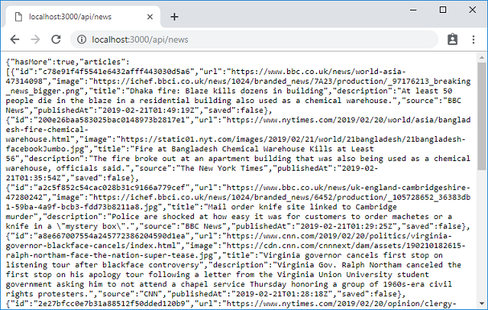

## What we will add in this step

In this step, we will add more APIs to our server for fetching news articles and managing bookmarks.

## Edited / added source files

### migrations/0001_create_saved.js _(new)_

```js
exports.up = async function(knex) {
  await knex.schema.createTable("saved", table => {
    table.increments("id");
    table.integer("userId").notNullable();
    table.string("articleId").notNullable();
    table.text("article");
    table.unique(["userId", "articleId"]);
  });
};

exports.down = async function(knex) {
  await knex.schema.dropTable("saved");
};
```

### lib/server.js

```js
"use strict";

const express = require("express");
const gourmet = require("@gourmet/client-lib");
const serverArgs = require("@gourmet/server-args");
const bodyParser = require("body-parser");
const session = require("express-session");
const KnexSessionStore = require("connect-session-knex")(session);
const knex = require("./knex");
const account = require("./account");
const news = require("./news");

const SESSION_COOKIE_NAME = "session_id";

const args = serverArgs({workDir: __dirname + "/.."});
const app = express();

app.use(session({
  name: SESSION_COOKIE_NAME,
  cookie: {
    maxAge: 7 * 24 * 60 * 60 * 1000  // 7 days
  },
  secret: "uWduZ4lSD8hwIIISBq650RZFjY8uIWds5Z6u7hjJ",
  resave: false,
  saveUninitialized: false,
  store: new KnexSessionStore({knex})
}));

app.use(bodyParser.json());
app.use(gourmet.middleware(args));

app.post("/api/signup", (req, res, next) => {
  account.createUser(req.body).then(user => {
    account.login(req, user);
    res.json({user});
  }).catch(next);
});

app.post("/api/login", (req, res, next) => {
  account.verifyPassword(req.body).then(user => {
    account.login(req, user);
    res.json({user});
  }).catch(next);
});

app.post("/api/logout", (req, res) => {
  req.session.destroy(() => {
    res.clearCookie(SESSION_COOKIE_NAME);
    res.json({});
  });
});

app.get("/api/news", account.protectApi, (req, res, next) => {
  news.getNews(req.user.id, req.query.page).then(data => {
    res.json(data);
  }).catch(next);
});

app.get("/api/saved", account.protectApi, (req, res, next) => {
  news.getSaved(req.user.id, req.query.page).then(data => {
    res.json(data);
  }).catch(next);
});

app.post("/api/saved", account.protectApi, (req, res, next) => {
  news.save(req.user.id, req.body.article).then(data => {
    res.json(data);
  }).catch(next);
});

app.delete("/api/saved/:id", account.protectApi, (req, res, next) => {
  news.unsave(req.user.id, req.params.id).then(data => {
    res.json(data);
  }).catch(next);
});

app.get(["/login", "/signup"], (req, res) => {
  res.serve("public");
});

app.get(["/", "/saved"], account.loginRequired, (req, res) => {
  res.serve("main", {user: req.user});
});

app.use(gourmet.errorMiddleware());

app.listen(args.port, () => {
  console.log(`Server is listening on port ${args.port}`);
});
```

### lib/news.js _(new)_

```js
"use strict";

const querystring = require("querystring");
const crypto = require("crypto");
const fetch = require("node-fetch");
const knex = require("./knex");

const NEWS_API_URL = "https://newsapi.org/v2/everything";
const NEWS_API_KEY = process.env.NEWS_API_KEY;
const NEWS_LANGUAGE = "en";
const NEWS_SOURCES = "cnn,bbc-news,business-insider,the-new-york-times";
const NEWS_PAGE_SIZE = 10;
const NEWS_LAST_PAGE = 1000 / NEWS_PAGE_SIZE;

if (!NEWS_API_KEY)
  throw Error("You must set your newsapi.org API key in environment variable NEWS_API_KEY");

function _getHash(str) {
  return crypto.createHash("md5").update(str).digest("hex");
}

async function getNews(userId, page=1) {
  const query = querystring.stringify({
    page,
    language: NEWS_LANGUAGE,
    sources: NEWS_SOURCES,
    pageSize: NEWS_PAGE_SIZE,
    apiKey: NEWS_API_KEY
  });
  const res = await fetch(`${NEWS_API_URL}?${query}`);
  const data = await res.json();
  const articles = data.articles.map(a => ({
    id: _getHash(a.url),
    url: a.url,
    image: a.urlToImage,
    title: a.title,
    description: a.description,
    source: a.source.name || a.source.id,
    publishedAt: a.publishedAt
  }));
  const ids = articles.map(a => a.id);
  const savedIds = await knex.select("articleId").from("saved")
                             .where("userId", userId)
                             .andWhere("articleId", "in", ids)
                             .then(rows => rows.map(rows => rows.articleId));
  return {
    hasMore: page < NEWS_LAST_PAGE,
    articles: articles.map(a => ({
      ...a,
      saved: savedIds.indexOf(a.id) !== -1
    }))
  };
}

async function getSaved(userId, page=1) {
  const q = knex.select().from("saved").where({userId});
  const count = (await q.clone().count("* as count"))[0].count; // query returns `[{count: n}]`
  const offset = (page - 1) * NEWS_PAGE_SIZE;
  const data = await q.clone().orderBy("id", "desc").offset(offset).limit(NEWS_PAGE_SIZE);

  return {
    hasMore: offset + data.length < count,
    articles: data.map(item => ({
      ...(JSON.parse(item.article)),
      id: item.articleId,
      saved: true
    }))
  };
}

async function save(userId, article) {
  const {id, saved, ...a} = article;

  await knex.insert({
    userId,
    articleId: id,
    article: JSON.stringify(a)
  }).into("saved");

  return true;
}

async function unsave(userId, articleId) {
  await knex.delete().from("saved").where({
    userId,
    articleId
  });

  return true;
}

exports.getNews = getNews;
exports.getSaved = getSaved;
exports.save = save;
exports.unsave = unsave;
```

### package.json

```json
{
  "private": true,
  "scripts": {
    "build": "gourmet build",
    "start": "node lib/server.js",
    "dev": "nodemon --ignore src lib/server.js -- --watch",
    "migrate": "knex migrate:latest",
    "migrate:rollback": "knex migrate:rollback"
  },
  "dependencies": {
    "express": "^4.16.4",
    "@gourmet/server-args": "^1.2.4",
    "@gourmet/client-lib": "^1.2.4",
    "body-parser": "^1.18.3",
    "@gourmet/error": "^0.3.4",
    "knex": "^0.16.3",
    "pg": "^7.9.0",
    "sqlite3": "^4.0.6",
    "express-session": "^1.15.6",
    "connect-session-knex": "^1.4.0",
    "bcrypt": "^3.0.5",
    "node-fetch": "^2.3.0"
  },
  "devDependencies": {
    "@gourmet/gourmet-cli": "^1.1.4",
    "@gourmet/preset-react": "^1.5.0",
    "@gourmet/group-react-i80": "^1.3.0",
    "core-js": "^3.0.0",
    "react": "^16.8.5",
    "react-dom": "^16.8.5",
    "nodemon": "^1.18.10"
  }
}
```

## Using News API

To implement our news fetching API, we need a news provider. We depend on [News API](https://newsapi.org/) for that. News API is an easy-to-use API service that crawls and indexes news articles from over 30,000 news sources and blogs around the world.

To use News API, first you need to get an [API key](https://newsapi.org/register). You'll need your own API key to run examples in this step.

To get a sense of how news articles fetched from News API look, see the example below.

```json
{
  "status": "ok",
  "totalResults": 19995,
  "articles": [
    {
      "source": {
        "id": "cnn",
        "name": "CNN"
      },
      "author": "Analysis by Chris Cillizza, CNN Editor-at-large",
      "title": "What if the Mueller report changes nothing?",
      "description": "Thanks to CNN reporting, we now know that Attorney General Bill Barr is...",
      "url": "https://www.cnn.com/2019/02/20/politics/robert-mueller-russia-investigation-findings/index.html",
      "urlToImage": "https://cdn.cnn.com/cnnnext/dam/assets/180831102830-04-robert-mueller-lead-image-super-tease.jpg",
      "publishedAt": "2019-02-21T00:33:49Z",
      "content": "THE POINT -- NOW ON YOUTUBE! \r\nIn each episode of his weekly YouTube show, ..."
    },
    ...
  ]
}
```

## New database table: `saved`

We added a migration file to create a new database table for saving bookmarks.

Each row in `saved` table has the following columns:

- `userId`: the owner of the saved article (integer row ID of the account)
- `articleId`: the article ID (hex string)
- `article`: the stringified JSON object of the article

## Adding server APIs

We added four more API routes (`GET /api/news`, `GET /api/saved`, `POST /api/saved`, `DELETE /api/saved/{id}`) to our server. They are implemented using helpers from `news.js`.

The `news.js` module provides helper functions for fetching news and managing bookmarks. Inside, `getNews()` is a function that fetches the latest news articles from News API, and converts them to the internal format. We use `node-fetch` module to make AJAX requests from our server to News API.

While converting, we generate a unique ID for each article, which is an MD5 hex digest of the article's URL.

`getSaved()` is a function that fetches the saved articles (bookmarks) from the database. `save()` and `unsave()` are functions for saving and deleting the saved articles.

## Running and testing

In this step, we added the following new package as a dependency:

- `node-fetch`: A light-weight module that brings `window.fetch` to Node.js

As we added a new dependency and a migration file, you need to run the following once.

```text
npm install
npm run migrate
```

You must provide an API key for News API in `NEWS_API_KEY` environment variable to run your server as below. (Be sure to replace the example hex string with your own API key.)

```text
NEWS_API_KEY=0123456789abcdef0123456789abcdef npm run dev
```

For Windows, run the following instead.

```text
set NEWS_API_KEY=0123456789abcdef0123456789abcdef
npm run dev
```

Open your browser, and log in to the app. Enter `http://localhost:3000/api/news` into the URL box. If you see the news articles encoded as a JSON object as below, you have successfully completed this step.



> It is important to test the API in your browser after successful login, because our news related APIs are protected by `account.projectApi`, which requires an authenticated session cookie.
